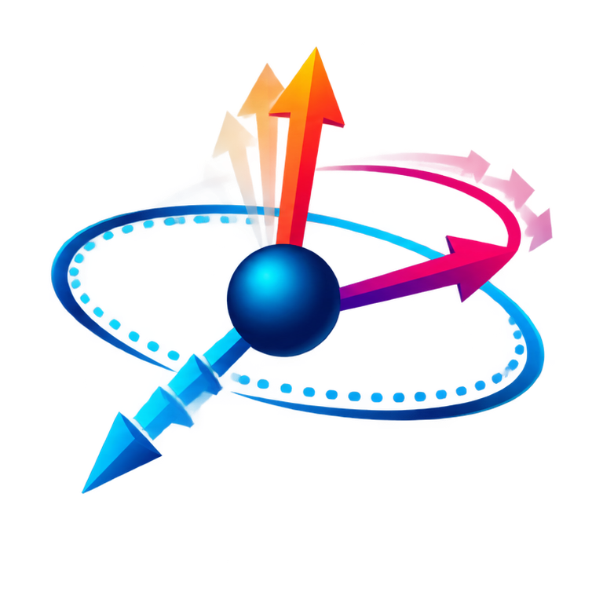

<p align="center">
  
</p>

<p align="center">
  <strong>English</strong> | <a href="README.zh-CN.md">简体中文</a>
</p>

# SpinMDKit

[](https://github.com/LYKD/spinmdkit/actions/workflows/ci.yml)
[](LICENSE)

**SpinMDKit is a format-extensible magnetic-moment post-processing framework for
spin molecular dynamics.** It streams large trajectories, calculates magnetic
observables, exports analysis-ready time series, and renders three-dimensional
spin-vector views. Extended XYZ for current NEP-spin/GPUMD results is the first
built-in adapter, not the boundary of the project.

The project is intentionally small at its foundation: one explicit frame model,
one schema-driven streaming reader, a tested Python API/CLI, and optional C++17
kernels. Version 1.0.0 establishes the stable base for a downloadable toolkit;
future simulation formats can be added without changing the data, analysis, or
visualization layers.

## Install

Download a wheel from the [Releases page](https://github.com/LYKD/spinmdkit/releases)
and install it with pip:

```bash
python -m pip install spinmdkit-1.0.0-...whl
```

The base installation has one runtime dependency: **NumPy**. Plotting is a
separate optional feature:

```bash
python -m pip install "spinmdkit[plot]"
```

Or build the C++17 extension from source:

```bash
git clone https://github.com/LYKD/spinmdkit.git
cd spinmdkit
python -m pip install ".[test]"
python -m pytest
```

The source build needs a C++17 compiler. A NumPy-only installation can be built
without the native module when necessary:

```bash
SPINMDKIT_DISABLE_NATIVE=1 python -m pip install .
```

In PowerShell, set the option with
`$env:SPINMDKIT_DISABLE_NATIVE='1'` before running pip. The native extension is
optional; failure to compile it does not prevent the NumPy implementation from
being installed.

## Quick start

Inspect a GPUMD trajectory without loading it all into memory:

```bash
spinmdkit inspect trajectory.xyz --species U
```

Format selection is automatic by file suffix or explicit when needed:

```bash
spinmdkit formats
spinmdkit inspect trajectory.xyz --format extxyz --species U
```

Export net magnetization, local-moment magnitudes, magnetic-force norms, and the
derived `spin x mforce` torque norm:

```bash
spinmdkit timeseries trajectory.xyz -o magnetic-timeseries.csv --species U
```

Export the numerical data and render the net `Mx/My/Mz/|M|` plus
mean/minimum/maximum local-moment evolution in one command:

```bash
spinmdkit plot-moments trajectory.xyz --species U \
  --timestep 0.001 --sample-every 100 --time-offset 0.2 \
  --time-unit ps --moment-unit "μB" -o moment_time_evolution.png
```

This writes `moment_time_evolution.csv` beside the two-panel horizontal PNG.
Here `--sample-every` is the number of MD steps between stored frames;
`--frame-stride` is available when post-processing downsampling is also wanted.
Use `--time-source metadata --time-key Time` when frame metadata already carries
time values.

For an antiferromagnet, supply the sublattice signs explicitly. The pattern is
repeated across the selected atoms only when its length divides their count:

```bash
spinmdkit timeseries trajectory.xyz -o afm.csv \
  --species U --sublattice-pattern "+--+"
```

Render one frame as three-dimensional colored arrows:

```bash
spinmdkit plot-frame trajectory.xyz -o frame-0.png \
  --frame 0 --species U --normalize
```

Self-contained examples are stored one per directory. The complete time-axis,
CSV, and two-panel workflow is documented in
[`examples/moment_time_evolution`](examples/moment_time_evolution/README.md).
The eight-atom AFM example can be inspected with:

```bash
spinmdkit inspect examples/afm_frame/trajectory.xyz --species U \
  --sublattice-pattern "+--+" --json
```

## Python API

```python
from spinmdkit import iter_extxyz, summarize_frame

for frame in iter_extxyz("trajectory.xyz"):
    result = summarize_frame(frame, species="U")
    print(result["magnetization"], result["mean_moment_norm"])
```

Each `Frame` has `species`, `positions`, an optional `cell`, unmodified frame
`metadata`, and named per-atom `properties`. The reader supports arbitrary
Extended XYZ property schemas, including `spin`, `mforce`, and `spin_velocity`.
It also accepts `.xyz.gz` streams.

## Module boundaries

```text
spinmdkit.data           validated frame objects; no file or plot logic
spinmdkit.io             reader contracts, format registry, and trajectory access
spinmdkit.io.readers     isolated adapters; Extended XYZ is the first built-in one
spinmdkit.analysis       physical observables and frame summaries
spinmdkit.kernels        NumPy/native compute backend boundary
spinmdkit.export         dependency-light CSV serializers
spinmdkit.visualization  optional plotting; imports Matplotlib on demand
spinmdkit.cli            thin command composition only
```

Dependencies point in one direction. In particular, `io` never imports
analysis or plotting, and `analysis` never imports the CLI or Matplotlib. This
keeps each layer independently testable and makes format, physics, or rendering
bugs easier to isolate.

New formats implement the small `TrajectoryReader` contract and register a
name plus file extensions. Every adapter yields the same format-neutral `Frame`,
so no NEP/GPUMD condition is required in analysis or plotting code.

## Scientific contract

- `spin` is the local magnetic-moment vector read from the trajectory.
- `mforce` remains a separately named magnetic-force-like output.
- torque is a derived quantity calculated as `spin x mforce`; it is not treated
  as an independent label.
- the Néel vector is calculated only from explicit `+1/-1` sublattice signs.
- `stress`, `virial`, units, and sign conventions are preserved as source
  metadata. SpinMDKit does not silently convert them.
- values generated by a NEP/GPUMD simulation are model predictions, not DFT
  reference truth.

See [Data model](docs/data-model.md), [Architecture](docs/architecture.md), and
[Adding a reader](docs/adding-readers.md) for the design details.

## Version policy

Versions change only after an explicit maintainer instruction. Commits,
debugging sessions, CI runs, and feature additions never bump the version
automatically. See [VERSIONING.md](VERSIONING.md).

## Initial command surface

| Command | Purpose |
| --- | --- |
| `spinmdkit formats` | List currently registered input adapters |
| `spinmdkit inspect` | Stream and summarize trajectory structure and ranges |
| `spinmdkit timeseries` | Export per-frame magnetic observables to CSV |
| `spinmdkit plot-moments` | Export CSV and render a horizontal two-panel moment history |
| `spinmdkit plot-frame` | Render a static 3D spin-vector image |

## Roadmap

1. Additional simulation formats and trajectory writers through isolated adapters.
2. Spatial, sublattice, and temperature-resolved magnetic observables.
3. Interactive and batch visualization pipelines.
4. Stable plugin interfaces for domain-specific analyses.
5. Benchmarks and scalable parallel readers for production trajectories.

Contributions and reproducible test cases are welcome. See
[CONTRIBUTING.md](CONTRIBUTING.md).
