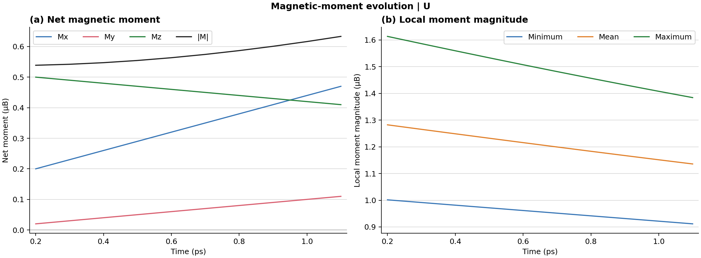

# Magnetic-moment time evolution

This example turns one multi-frame Extended XYZ trajectory into a numerical CSV
and a two-panel horizontal figure. The input is deliberately small and
synthetic so the command can be checked quickly.

From the repository root, install the plotting option and run:

```bash
python -m pip install -e ".[plot]"
spinmdkit plot-moments examples/moment_time_evolution/trajectory.xyz \
  --species U --timestep 0.001 --sample-every 100 \
  --time-offset 0.2 --time-unit ps --moment-unit "μB" \
  --output examples/moment_time_evolution/output/moment_time_evolution.png
```

The one analysis command writes both:

- `output/moment_time_evolution.csv`: frame, physical time, selected atom
  count, net `Mx/My/Mz/|M|`, and mean/minimum/maximum local-moment magnitude.
- `output/moment_time_evolution.png`: net moment on the left and local-moment
  magnitude statistics on the right.



For the command above, stored frames are separated by 100 MD integration steps
of 0.001 ps, and the 0.2 ps offset compensates for a preceding interval. Thus

```text
time = 0.2 ps + frame_index * 0.001 ps * 100
```

`--sample-every` describes how often the trajectory was written. It does not
skip data during analysis. To analyze only every Nth stored frame, additionally
use `--frame-stride N`; computed times still use the original frame indices.

If the trajectory already carries a numeric frame-level time, use it explicitly:

```bash
spinmdkit plot-moments trajectory.xyz --species U \
  --time-source metadata --time-key Time --time-scale 0.001 \
  --time-offset 0.0 --time-unit ps --moment-unit "μB" \
  --output moment_time_evolution.png
```

The definitions are deliberately explicit:

```text
M(t)             = sum_i s_i(t)
|M(t)|           = norm(M(t))
local mean(t)    = mean_i norm(s_i(t))
local minimum(t) = min_i norm(s_i(t))
local maximum(t) = max_i norm(s_i(t))
```

The sum and local statistics include only atoms selected by `--species`. Units
are labels supplied by the user; SpinMDKit does not silently convert trajectory
values.
