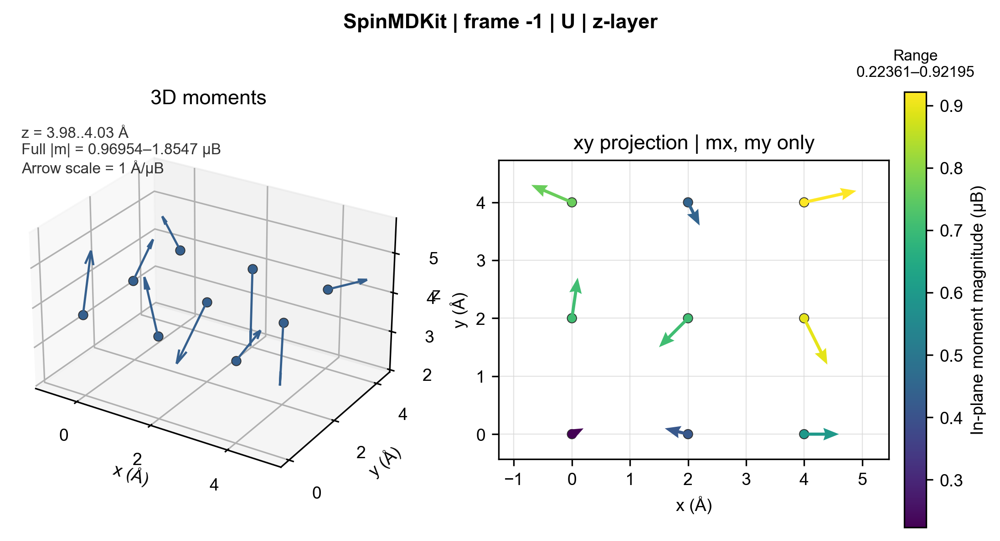

<p align="center">
  <a href="README.md">English</a> | <strong>简体中文</strong>
</p>

# 顶层磁矩箭头图

这个示例读取轨迹的最后一帧，选择 U 原子，将 z 方向最上面的一层识别为一个
原子面，并绘制其中每个原子的磁矩。顶层由 9 个带有轻微 z 起伏的 U 原子组成，
因此选层不依赖坐标完全相等。

在仓库根目录安装绘图依赖并运行：

```bash
python -m pip install -e ".[plot]"
spinmdkit plot-layer examples/top_layer_moments/trajectory.xyz \
  --frame -1 --species U --axis z --layer top \
  --arrow-scale 1.0 --position-unit "Å" --moment-unit "μB" \
  --output examples/top_layer_moments/output/top_layer_moments.svg
```



这一条命令会生成同名的可编辑 SVG、矢量 PDF 和 PNG 预览，其中 SVG 是后续编辑
使用的主文件。

左图保留完整的三维磁矩方向。右图是对应的面内投影：本命令选择 z 层，因此使用
xy 坐标且只绘制 `(mx, my)`。投影箭头的长度和颜色由面内磁矩模长控制，右侧色标
给出其数值范围。图中报告的箭头比例同时用于两幅图，选中的 9 个原子会全部显示。

其他法向也遵循同一规则：`--axis x` 增加 yz 投影并只使用 `(my, mz)`；
`--axis y` 增加 xz 投影并只使用 `(mx, mz)`。

如果已经知道原子层的位置，可以用明确的坐标和容差代替自动边界层识别：

```bash
spinmdkit plot-layer examples/top_layer_moments/trajectory.xyz \
  --frame -1 --species U --axis z \
  --coordinate 4.0 --tolerance 0.08 \
  --arrow-scale 1.0 --position-unit "Å" --moment-unit "μB" \
  --output examples/top_layer_moments/output/top_layer_moments.svg
```

显式选择会包含源位置单位下满足 `|z - 4.0| <= 0.08` 的原子。SpinMDKit 会在
终端报告选中原子数、实际 z 范围、选择模式、完整局域磁矩范围和面内磁矩范围。

如果自动边界层识别只能得到一个原子，命令会停止并要求显式提供
`--tolerance`，不会把单个离群原子静默当作一个原子面。
